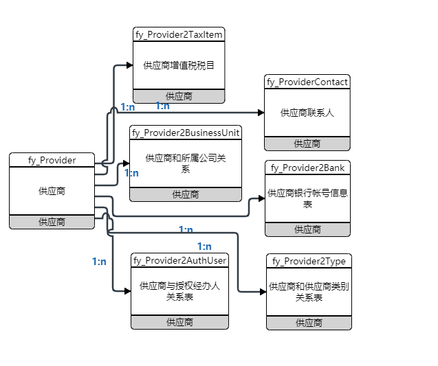
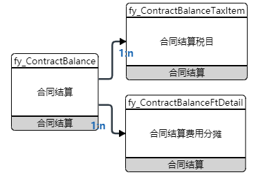

# ERP 数据库结构分析

## 1. 销售系统

## 2. 成本系统

## 3. 计划系统

## 4. 采招系统

## 5. 费用系统

### 5.1 基础设置

#### 5.1.1 科目模板

##### 5.1.1.1 涉及表

##### 5.1.1.2 ER 关系

#### 5.1.2 科目

##### 5.1.2.1 涉及表

##### 5.1.2.2 ER 关系

#### 5.1.3 费用承担主体

##### 5.1.3.1 涉及表

##### 5.1.3.2 ER 关系

#### 5.1.4 供应商

##### 5.1.4.1 涉及表

##### 5.1.4.2 ER 关系

#### 5.1.5 业务授权

##### 5.1.5.1 涉及表

##### 5.1.5.2 ER 关系

#### 5.1.5 预算管理

##### 5.1.5.1 预警基础表

1. 表

2. ER关系

   

##### 5.1.5.2 预算管控方式设置

1. 表

2. ER关系

   

##### 5.1.5.3 全盘营销预算编制

1. 表

2. ER关系

   

##### 5.1.5.4 年度费用预算编制

1. 表

2. ER关系

   

##### 5.1.5.5 年度费用预算审核

 1. 表

 2. ER关系

    

##### 5.1.5.6 月度费用计划编制

1. 表

2. ER关系

   

#### 5.1.6 合同管理

##### 5.1.6.1 合同立项 

1. 表

2. ER关系

   

##### 5.1.6.2 合同

1. 表

2. ER关系

   

##### 5.1.6.3 补充合同

1. 表

2. ER关系

   

##### 5.1.6.4 合同结算

1. 表

2. ER关系

   

##### 5.1.6.5 合同验收

1. 表

2. ER关系

   

##### 5.1.6.6 付款申请

1. 表

2. ER关系

   

##### 5.1.6.7 合同归集

1. 表

2. ER关系

   

### 6.1 报销管理
#### 6.1.1 报销参数设置
##### 6.1.1.1 费用类型

1. 表

2. ER关系

   

##### 6.1.1.2 岗位级别

1. 表

2. ER关系

   

##### 6.1.1.3 用户岗位级别

1. 表

2. ER关系

   

##### 6.1.1.4 岗位级别

1. 表
2. ER关系

##### 6.1.1.5 岗位级别

1. 表
2. ER关系

##### 6.1.1.5 岗位级别

1. 表
2. ER关系

##### 6.1.1.5 岗位级别

1. 表
2. ER关系

##### 6.1.1.5 岗位级别

1. 表
2. ER关系

##### 6.1.1.5 岗位级别

1. 表
2. ER关系

##### 6.1.1.5 岗位级别

1. 表
2. ER关系